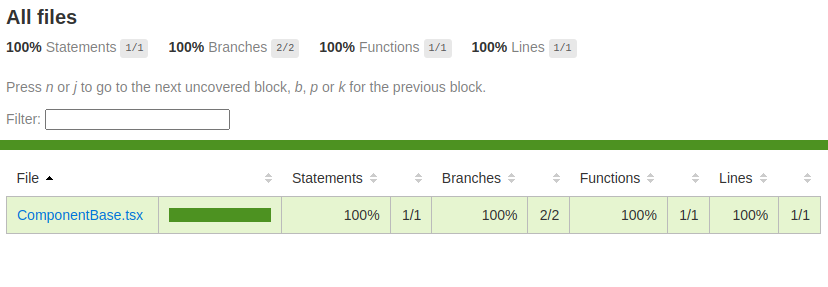

# VIPFS-Protocol


[](https://www.npmjs.com/package/vipfs-protocol)


A robust TypeScript library for fragmenting, encrypting and uploading large video files to IPFS, using Ethereum-derived keys for security. Generates a JSON index to ensure video can be safely reassembled and decrypted later.

<p align="center">
  <a href="https://github.com/netzulo/vipfs-protocol">
    
  </a>
</p>

---

## 🚀 Features

- 🔐 Fragmentation and encryption of videos with Ethereum-derived keys
- 🧩 IPFS upload and index generation for decentralized storage
- ♻️ Retry and resiliency system for reliable uploads
- ⚡ TypeScript-first, fully type-safe API
- 🧪 Modular design with unit tests for each step

---

## 📦 Installation

```bash
npm install vipfs
```

or

```bash
yarn add vipfs-protocol
```

---

## 🧪 Usage

```tsx
import {
  // helpers
  // hooks
  // services
  VideoEncryptionManager,
} from 'vipfs-protocol'

const manager = new VideoEncryptionManager(myEthereumWallet)
const indexJson = await manager.encryptAndUpload('/path/to/video.mp4')
// Later, to reassemble the video:
const videoBuffer = await manager.downloadAndDecrypt(indexJson)
```

📘 For our website, visit [Github](https://github.com/netzulo/vipfs-protocol)
📘 For full documentation, visit [Github](https://github.com/netzulo/vipfs-protocol)

---

## 🛠️ Development

### Setup

```bash
npm install
```

### Run dev server

```bash
npm run dev
```

### Full build & lint cycle

```bash
npm run ci
```

or 

```bash
yarn ci
```

**⚠️ Reminder**: Clean up unused CSS classes in `public/output.css` after changes. Tailwind can generate many unused classes.

---

## 📜 NPM Scripts

| Script          | Description                                                                                      |
|-----------------|--------------------------------------------------------------------------------------------------|
| `dev`           | Starts the development server                                                                    |
| `css`           | Builds the CSS                                                                                   |
| `css:dev`       | Builds CSS in watch/dev mode                                                                     |
| `test`          | Runs tests with coverage                                                                         |
| `lint`          | Runs ESLint                                                                                      |
| `lint:fix`      | Fixes lint errors                                                                                |
| `format`        | Formats code using Prettier                                                                      |
| `build`         | Builds for production                                                                            |
| `preview`       | Previews the production build locally                                                            |
| `ci`            | Runs tests, lint, and formatting                                                                 |
| `clean`         | Cleans `dist`, `node_modules`, `package-lock.json`, etc.                                         |

---

## 🧩 Components / Modules

Each module has dedicated tests to ensure reliability and to simplify future extensions.

- **VideoFragmenter** – Splits video files into fixed-size binary chunks
- **FragmentEncryptor** – Encrypts/decrypts each chunk using Ethereum wallet-derived keys
- **IPFSUploader** – Uploads/downloads each encrypted chunk to/from IPFS
- **IndexManager** – Generates and updates the JSON index file with fragment metadata
- **EthereumWallet** – Derives secure keys from an Ethereum wallet for encryption

---

## 👥 Contributing

We welcome contributions! Please read our [contributing guide](CONTRIBUTING.md) and follow the code style defined in `.eslintrc`.

### Coverage

Coverage is generated in `.coverage/index.html`, and you can view it in your browser. To generate coverage, run:

```bash
yarn test
```

This is an example of the coverage report:



---

## 📄 License

[MIT](./LICENSE)

---

## 📬 Contact Us

For questions, feedback, or business inquiries:

**✉️ Email**: [netzuleando@gmail.com](mailto:netzuleando@gmail.com)  
**🌐 Website**: [Github](https://github.com/netzulo/vipfs-protocol)

---

## 👨‍💻 Authors

Made with ❤️ by the [@Netzulo](https://github.com/netzulo)
